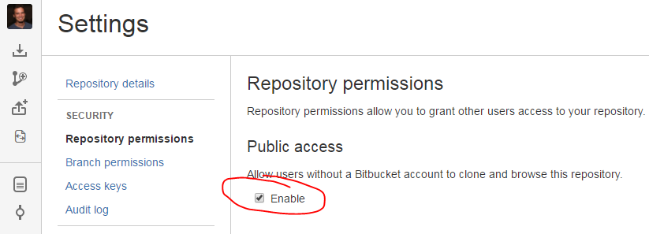
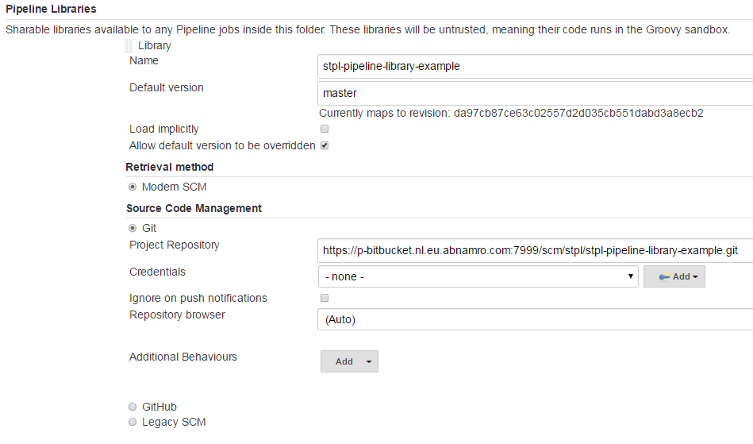
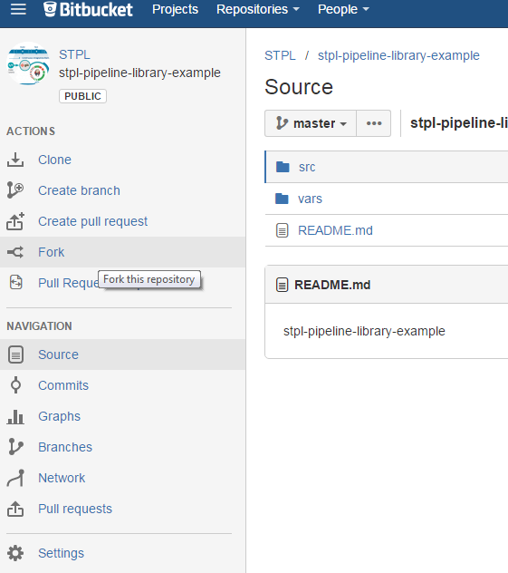
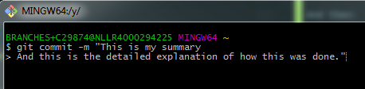

# Contribution guide

How to contribute to the Standard Pipelines (STPL)-project.

## Table of Contents

   1. [Requirements](#Requirements)
   1. [Making changes to the pipeline](#make-changes)
   1. [SOLO Pipeline Application](#valid-use-cases)
   1. [Coding Guidelines](#coding_guidelines)
   1. [FAQ](#faq)

## Requirements <a name="Requirements"></a>

- A decent editor with Groovy support, like IntelliJ, VS Code, Sublime, etc. (No notepad or notepad++)
- Groovy SDK
- Java JDK
- Good Development skills (see: [Coding Guidelines](#coding_guidelines))

## Making changes to the pipeline<a name="make-changes"></a>

Please let us know when you want to work on a new feature for the pipeline. 

We want to avoid, for example, people creating features that someone else is already working on, or features that will never be used.

### Valid use cases to work on a feature/bugfix

* Can and will be used by more teams (please validate this with other teams -> make a good case)
* Has added value
* Missing functionality (example: Add SVN support next to Git)
* Top down regulation case (example: improvements required by CISO / CoE SD)
* Fix a bug (example: artifacts are uploaded to wrong repository)

### Way of working

* Create a fork


* Change the code of the fork (in the develop branch)
* Follow the Git standard regarding [commit messages](#commitMessage)
* Test your changes in Jenkins PR
    * You can do this by adding your fork temporarily to your [folder as a shared library](#folderLibrary)
* Create a [Pull Request](#pull_request) 
* Core development team will review and validate (e.g. all standards are met) 
* Core development team will merge to develop branch and later to master branch

Notes:
- When changes have impact on running pipelines the core developer will delay the merge to the master branch after communication to all the teams (this is why we still have develop- and master-branches: so we can make a difference between code that is finished and code that is released)
- When your change require modifications in the environment (changes to Jenkins or other tools) you should first test your changes in ST/ET environments. Please [contact us](#contact) on how to do this

### Creating a pull request<a name="pull_request"></a>

Before submitting a Pull Request, please verify if the following is finished:
- your code should be set up to work with all projects, not just the one you are working on
- your code has been tested with a project that is already using the standard pipeline
- your code does not break any other (previously developed) features
- the user documentation (in the docs-folder) is updated and reflects the current situation
- all introduced/changed properties are documented (this is also user documentation)
- there are no conflicts in your Pull Request (tip: merge in Master-branch before you create the Pull Request)
- your code is cleaned up (no more debugging statements, no TODOs, no commented code blocks)

Enter your pull request through the GUI of Bitbucket. [Link to documentation, read the part "Forking Workflow With Pull Requests"](https://www.atlassian.com/git/tutorials/making-a-pull-request).

Your Pull Request should contain the following information:

- type of pull request: is this a bugfix / improvement / new feature?
- a description of your change, what is the added value (see valid use cases)?
- a single line with a description that can be used for our Release Notes

## Coding guidelines<a name="coding_guidelines"></a>

The core development team has setup a [Style guide](styleguide.md). Please use this guide to align your style of development/coding to this guide.

### Software Development principles

We expect a contributor to be famlliar with these concepts.

* [SOLID](https://en.wikipedia.org/wiki/SOLID_(object-oriented_design))
* [DRY](https://en.wikipedia.org/wiki/Don%27t_repeat_yourself)
* [KISS](https://en.wikipedia.org/wiki/KISS_principle)
* [Continuous Integration](https://en.wikipedia.org/wiki/Continuous_integration)
* [YAGNI](https://en.wikipedia.org/wiki/You_aren%27t_gonna_need_it)
* [Premature Optimization](http://wiki.c2.com/?PrematureOptimization)
* [Jenkins Best practices](JENKINS_PIPELINE_BEST_PRACTICES,md)

### Rules of thumb

- Shell-commands

> Do not use shell scripts or multiline shell commands

* As shell scripts cannot easily be validated, we should try to use as much groovy as possible. Shell scripts should be one-liners. 
* Remember to use platform-specific shell-commands because your build could be running on Linux and Windows.

- Use [Go](https://golang.org/) for complex logic

> If you need to execute of lot of logic please use Go (example: consuming APIs) instead of Groovy.

Groovy-code is executed on the Jenkins Master (not on the Slave Nodes) so adding logic will add a lot of load to the Jenkins Masters. If you use Go your binary will be executed on the Slave Node. Go is a platform-independent language.

- Core-pipeline

> Features that are generic for all pipelines: put it in the core. If you're uncertain: implement it in the pipeline you are already working on.

## FAQ

### Add Forked Library to your Folder and test it <a name="folderLibrary"></a>



And then:
```groovy
@Library(['stpl-pipeline-java-my-fork']) _
node {
    stage('sayHello') {
        sayHello('joost')
    }
}
```

### Create a fork <a name="fork"></a>

Go to the BitBucket repository you want to fork, press "Fork" in the left menu and then press "Create Fork" button.

You will now have a fork of this repository in your personal space.

You can find this via the top right menu (your icon) and then select "View Profile".
Or go to [Your Profile](https://p-bitbucket.nl.eu.abnamro.com:7999/profile).



### Git commit messages format <a name="commitMessage"></a>

1. Separate subject from body with a blank line
1. Limit the subject line to 50 characters
1. Capitalize the subject line
1. Do not end the subject line with a period
1. Use the imperative mood in the subject line
1. Wrap the body at 72 characters
1. Use the body to explain what and why vs. how

* [The Best Git Client](https://www.gitkraken.com/) (GitKraken)
* [Atlassian Git Client](https://www.sourcetreeapp.com/)
* [Best Practices](https://chris.beams.io/posts/git-commit/)

#### Multi-line commit message commandline 

If you use git via command line, please use [Git Bash](https://git-for-windows.github.io/).

In order to achieve this, simply open the message with *-m "* and then press enter for the new line.
Only after you've finished the whole description, do you close it with *"*. If you are working on a Jira ticket, 
please make sure the you include the Jira ticket nr (e.g. SOLO-1234).



